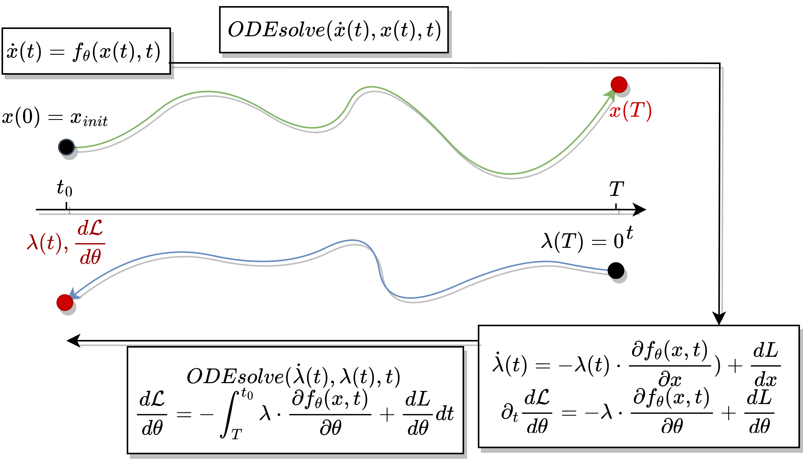

# Ajoint State Method for ODEs

This jupiter notebook supplements the written report on the adjoint state method. It implements
1. The difference of computational in "forward" and "backward" matrix - vector products
2. A nonlinear optimization problem solved with an adjoint method and gradient descent
3. A comprehensive clean code example of the adjoint state method that only uses ODE solvers. Comparison to finite differences

For a computationally efficint sensitivity calculation for ODEs and other equations, see the [SciMLSensitivity.jl](https://docs.sciml.ai/SciMLSensitivity/stable/) package for julia.

### Summary of the Adjoint State Method

